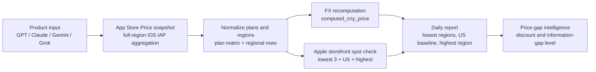

# AI Pricing Intelligence

[](https://github.com/xiaomiaode001/ai-pricing-intelligence/actions/workflows/validate.yml)

AI Pricing Intelligence is a Codex Skill for monitoring global iOS in-app subscription prices for AI products. It helps answer a daily question: **which regions currently have the cheapest iOS subscription price, how large is the gap, and whether the price signal is worth attention**.

The canonical Skill package lives in [`ai-subscription-pricing-intel/`](ai-subscription-pricing-intel/).

## What This Skill Is For

Use it when you want a clear daily report such as:

- `GPT套餐监测`
- `Claude套餐监测`
- `Gemini套餐监测`
- `Grok套餐监测` or `Gork套餐监测`

The report focuses on iOS IAP regional price gaps, not Web/API/Team/Enterprise pricing.

## Core Output

Every daily report uses the same base dimensions, so different products remain comparable even when their plan names differ.

| Dimension | What It Shows |
|---|---|
| 套餐 | Original App Store Price plan label, for example `ChatGPT Plus 1月` or `Claude Pro - Monthly 1月` |
| 周期 | Monthly, annual, or usage-style package |
| 地区数 | Number of storefront regions captured for the plan |
| 最低 3 地区 / 价格 / 汇率 | Three cheapest regions with local price, App Store Price CNY, FX rate, and recomputed CNY |
| 美国基准 | United States price as a common baseline |
| 最高地区 | Highest captured regional price |
| 相对美国折扣 | Discount of the lowest region versus the US baseline |
| 相对最高折扣 | Discount of the lowest region versus the highest region |
| 信息差等级 | `high`, `medium`, `low`, or `none` |
| Apple 复核状态 | Apple storefront spot-check status for the detailed plan |

## Example Snapshot

Sample from the ChatGPT daily report generated on 2026-06-30. Prices change over time; the table is an output-shape example, not a permanent price claim.

| Product | Focus Plan | Lowest Region | US Baseline | Highest Region | Gap vs Highest | Info Level |
|---|---|---|---|---|---:|---|
| ChatGPT | ChatGPT Plus 1月 | 菲律宾 / PHP999 / ¥110.86 | 美国 / $19.99 / ¥136.01 | 哥伦比亚 / COP99,900 / ¥197.10 | 43.75% | high |

### Lowest 3 Regions Example

| Rank | Region | Local Price | source_cny_price | FX Rate to CNY | computed_cny_price | FX Status |
|---:|---|---:|---:|---:|---:|---|
| 1 | 菲律宾 | PHP999 PHP | ¥110.86 | 0.110870 | ¥110.76 | fx_checked |
| 2 | 加拿大 | CAD24.99 CAD | ¥119.83 | 4.790400 | ¥119.71 | fx_checked |
| 3 | 巴基斯坦 | PKR4,900 PKR | ¥119.92 | 0.024360 | ¥119.36 | fx_checked |

### Product Matrix Example

| 套餐 | 周期 | 地区数 | 最低 3 地区 / 价格 / 汇率 | 美国基准 | 最高地区 | 相对美国折扣 | 相对最高折扣 | 信息差等级 |
|---|---|---:|---|---|---|---:|---:|---|
| ChatGPT Plus 1月 | 1M | 33 | 菲律宾 PHP999 / ¥110.86 / FX 0.110870<br>加拿大 CAD24.99 / ¥119.83 / FX 4.790400<br>巴基斯坦 PKR4,900 / ¥119.92 / FX 0.024360 | 美国 $19.99 / ¥136.01 | 哥伦比亚 COP99,900 / ¥197.10 | 18.49% | 43.75% | high |
| ChatGPT Go 1月 | 1M | 33 | 印尼 IDR75,000 / ¥28.53 / FX 0.000380<br>印度 INR399 / ¥28.73 / FX 0.072020<br>菲律宾 PHP300 / ¥33.29 / FX 0.110870 | 美国 $8 / ¥54.43 | 挪威 NOK99 / ¥67.81 | 47.58% | 57.93% | high |

## Intelligence Flow



## Source Roles

| Source | Role | Overwrite Rule |
|---|---|---|
| App Store Price | Primary full-region iOS IAP aggregation source | Kept as `source_cny_price`; never overwritten |
| Apple storefront | Spot-check source for selected regions | Shown side by side; never overwrites App Store Price |
| FX sources | Recompute CNY for verification | Writes `computed_cny_price`; never overwrites `source_cny_price` |
| Official pricing pages | Product and plan naming context | Not used to override iOS regional prices |

## Supported Products

| Key | Product | Provider | App Store ID | Default Detail Plan |
|---|---|---|---|---|
| `chatgpt` | ChatGPT | OpenAI | `6448311069` | `ChatGPT Plus 1月` |
| `claude` | Claude | Anthropic | `6473753684` | `Claude Pro 1月` |
| `gemini` | Google Gemini | Google | `6477489729` | `Google AI Pro (5 TB) 1月` |
| `grok` | Grok | xAI | `6670324846` | `SuperGrok 1月` |

## Repository Layout

| Path | Purpose |
|---|---|
| `ai-subscription-pricing-intel/` | Canonical Codex Skill package |
| `.github/` | GitHub Actions, issue templates, and PR template |
| `.agents/` | Project-local agent metadata |
| `README.md` | Repository overview |
| `LICENSE` | MIT license |
| `CHANGELOG.md` | Release notes |
| `CONTRIBUTING.md` | Contribution and validation guide |
| `SECURITY.md` | Security and data-handling policy |
| `RELEASE_CHECKLIST.md` | Pre-publish checklist |

## Quick Start

Use Python 3.10+; Python 3.12 is recommended. Run commands with UTF-8 enabled.

```powershell
cd "E:\AI Pricing Intelligence\ai-subscription-pricing-intel"
python -m venv .venv
.\.venv\Scripts\Activate.ps1
python -m pip install --upgrade pip
python -m pip install -r requirements.txt
python -X utf8 scripts/check_environment.py --strict
```

## Daily Monitoring

```powershell
python -X utf8 scripts/collect_appstoreprice_intel.py --today --intent-text "GPT套餐监测"
python -X utf8 scripts/collect_appstoreprice_intel.py --today --intent-text "Claude套餐监测"
python -X utf8 scripts/collect_appstoreprice_intel.py --today --intent-text "Gemini套餐监测"
python -X utf8 scripts/collect_appstoreprice_intel.py --today --intent-text "Grok套餐监测"
```

Daily reports are written to `ai-subscription-pricing-intel/outputs/`.

## Validation

```powershell
cd "E:\AI Pricing Intelligence\ai-subscription-pricing-intel"
python -X utf8 scripts/check_environment.py --strict
python -X utf8 scripts/check_release_readiness.py --strict
python -X utf8 -m unittest discover -s tests
python -X utf8 -m compileall scripts
python -X utf8 C:\Users\JS\.codex\skills\.system\skill-creator\scripts\quick_validate.py .
```

## Data Safety

Generated snapshots, normalized files, FX caches, Apple spot-check JSON, Markdown reports, `.env` files, credentials, cookies, and account-specific data are ignored by Git.

The project intentionally keeps only `.gitkeep` files inside runtime directories. Historical generated artifacts are pruned by retention policy, with at least the latest two snapshots per product retained for comparison.
